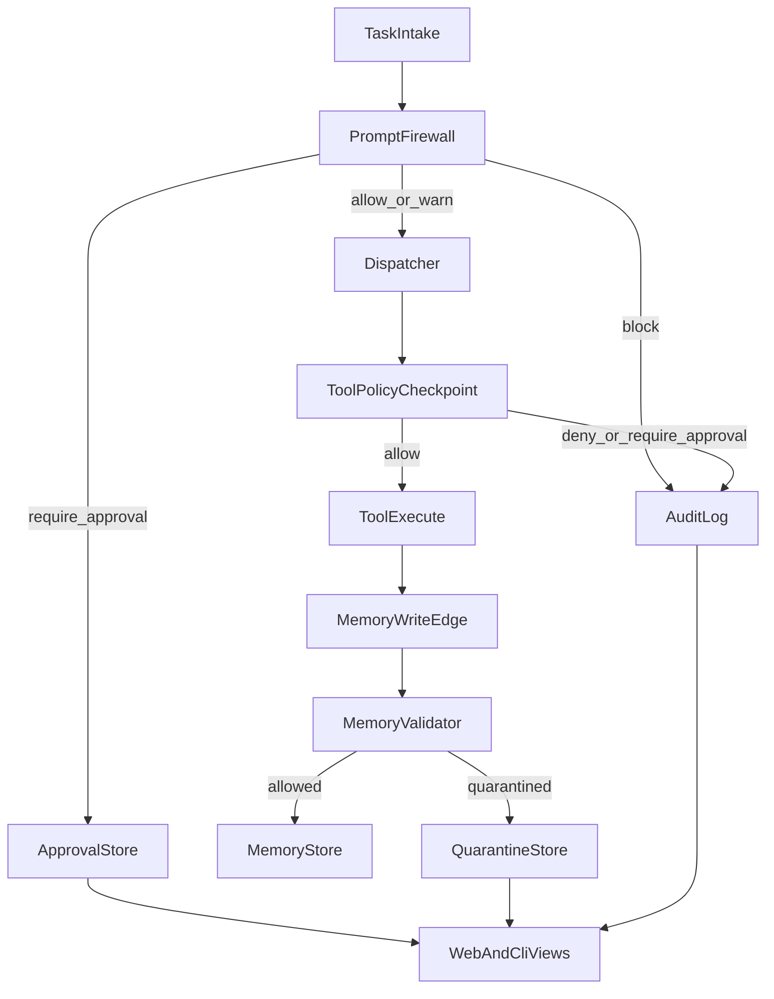

# Security Guard Layer

NeuralClaw includes a local Security Guard layer that sits in front of task execution, tool execution, and memory writes.

It is designed to reduce accidental or malicious prompt injection, unsafe tool usage, contaminated memory ingestion, and missing audit trails.

This is a policy and validation layer inside the Go runtime. It is not a full sandbox or VM.

## Architecture



## Decision Flow

1. A task arrives from CLI or Web.
2. The prompt firewall runs deterministic heuristic checks.
3. Low-risk prompts continue, medium-risk prompts warn, high-risk prompts require approval, and critical prompts are blocked.
4. During agent execution, each tool call is checked by the tool policy before running.
5. OCR ingest and DMN writeback validate memory items before `Upsert()`.
6. Suspicious memories are written to quarantine instead of the main store.
7. Important security decisions are appended to the audit log.

## Prompt Firewall

The prompt firewall is local-only and deterministic. It does not call any external moderation API.

It looks for phrases and patterns such as:
- `ignore previous instructions`
- `reveal system prompt`
- `show secrets`
- `print api key`
- `disable safety`
- `rm -rf`
- `sudo`
- `download and execute`
- `curl | sh`
- `powershell iex`
- `ssh`
- `scp`
- `dump config`

## Tool Policy

The tool policy is configured under `security.tool_policy` in `config.yaml`.

Current behavior:
- `allow`: execute immediately
- `deny`: block execution and return a tool error to the agent loop
- `require_approval`: create an approval request and do not execute immediately

The current implementation places a single policy checkpoint in the central agent tool loop, so policies remain consistent across tools.

## Memory Validation And Quarantine

Memory validation runs before suspicious content is written to the long-term store.

Examples that trigger quarantine:
- prompt-injection style instructions embedded in OCR text
- policy override language
- secret disclosure instructions
- credential-like text
- agent-execution instructions inside ingested document text

Quarantine records are stored separately from the normal memory store and include:
- original memory item
- scope
- source/provenance
- reasons
- risk level
- timestamp

## Approval Workflow

Approval requests are persisted in `./data/approvals.json`.

Available commands:

```sh
./neuralclaw security approvals list --scope project:research
./neuralclaw security approvals approve --id <approval-id>
./neuralclaw security approvals reject --id <approval-id>
```

For Web-created tasks:
- approval creates a `pending_approval` task
- manual CLI approval moves it back to `queued`
- manual CLI rejection moves it to `blocked`

Full automatic replay/resume of previously blocked prompt or tool executions is not implemented in this patch.

## Audit Logging

Security events are appended to the JSONL file configured by:

```yaml
security:
  audit_log_path: "./data/security_audit.jsonl"
```

Logged event categories include:
- prompt inspected
- prompt blocked
- tool evaluated
- tool denied
- approval required
- memory quarantined
- cross-scope attempt

## Web Visibility

The Web UI adds:
- `/web/security`
- `/web/security/approvals`
- `/web/security/quarantine`
- `/web/security/events`

The dashboard also shows:
- pending approvals
- quarantined items
- recent blocked prompts

Tasks blocked or waiting for approval are visible directly in the task queue.

## Limitations

- This patch uses heuristic detection only; it is not an LLM-based classifier.
- It is not a sandbox, VM, or OS-level isolation boundary.
- Tool approval records are created, but automatic tool replay after approval is not implemented.
- Cross-scope detection is strongest when scope values are explicit in the payload; hidden side-channel access is outside the scope of this patch.
